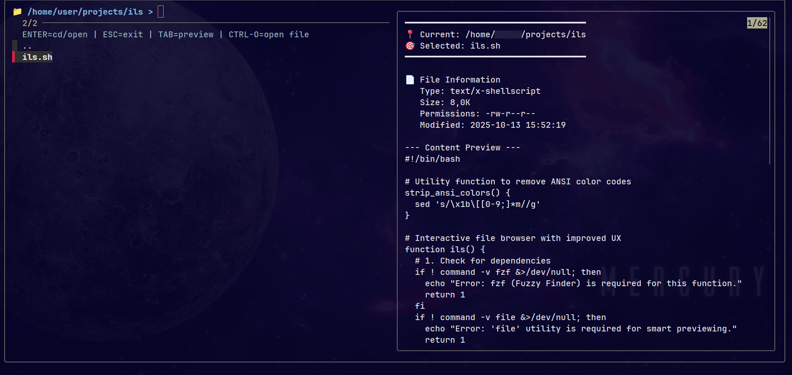

# ils - Interactive File Browser

A bash function for navigating directories interactively using fzf.

## Features

- Navigate directories without reloading
- Live preview of files and directories
- File type detection
- Archive contents preview
- Keyboard shortcuts for common actions

## Requirements

- fzf
- file utility
- Optional: bat (for syntax highlighting)

### Installing fzf

Debian/Ubuntu:
```bash
sudo apt install fzf
```

Arch Linux:
```bash
sudo pacman -S fzf
```

macOS:
```bash
brew install fzf
```

## Installation

Add to your `.bashrc` or `.zshrc`:

```bash
source /path/to/ils.sh
```

Reload your shell:

```bash
source ~/.bashrc
```

## Usage

Start the browser:

```bash
ils
```

Quick navigation to common directories:

```bash
ilsq
```

## Keyboard Shortcuts

- `Enter` - Navigate into directory or select file
- `ESC` - Exit browser
- `Tab` - Toggle preview window
- `Ctrl+O` - Open file with default application
- `Ctrl+E` - Open file in editor
- `Ctrl+Q` - Quick exit

## Changing Default Text Editor
The script uses your system's `$EDITOR` environment variable. To change it:
```bash
# Example for nvim
 
echo 'export EDITOR=nvim' >> ~/.bashrc
source ~/.bashrc

# Other editors:
# export EDITOR=vim
# export EDITOR=code  # VS Code
# export EDITOR=nano
```

## Screenshot



## Configuration

Edit the `ilsq` function to customize quick navigation directories.
